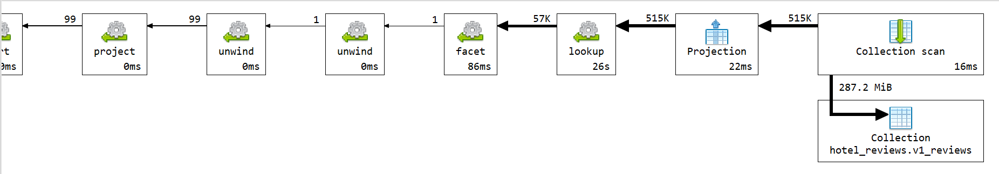
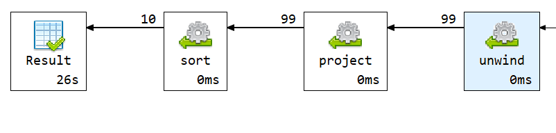

# Q1 - Pouzdani hoteli

## Sta upit radi

Upit pronalazi top 10 najpouzdanijih hotela u izabranom gradu, u ovom primeru u Amsterdamu. 
Da bi se hotel nasao u listi, mora imati barem 100 recenzija.
Pouzdanost (reliability_score) se racuna pomocu Bayesian Average formule.

Formula:

```text
review_count / (review_count + 100) * hotel_average + 100 / (review_count + 100) * city_average
```

## Kod upita

```js

db.v1_reviews.aggregate(
[
  {
    $lookup: {
      from: "v1_hotels",
      localField: "hotel_id",
      foreignField: "_id",
      as: "hotel"
    }
  },
  {
    $unwind: "$hotel"
  },
  {
    $match: {
      "hotel.city": "Amsterdam"
    }
  },
  {
    $facet: {
      cityStats: [
        {
          $group: {
            _id: null,
            city_average_score: { $avg: "$reviewer_score" }
          }
        }
      ],
      hotelStats: [
        {
          $group: {
            _id: "$hotel._id",
            hotel_name: { $first: "$hotel.name" },
            address: { $first: "$hotel.address" },
            city: { $first: "$hotel.city" },
            country: { $first: "$hotel.country" },
            average_reviewer_score: { $avg: "$reviewer_score" },
            review_count: { $sum: 1 }
          }
        },
        {
          $match: {
            review_count: { $gte: 100 }
          }
        }
      ]
    }
  },
  {
    $unwind: "$cityStats"
  },
  {
    $unwind: "$hotelStats"
  },
  {
    $project: {
      _id: 0,
      hotel_id: "$hotelStats._id",
      hotel_name: "$hotelStats.hotel_name",
      address: "$hotelStats.address",
      city: "$hotelStats.city",
      country: "$hotelStats.country",
      average_reviewer_score: {
        $round: ["$hotelStats.average_reviewer_score", 2]
      },
      review_count: "$hotelStats.review_count",
      city_average_score: {
        $round: ["$cityStats.city_average_score", 2]
      },
      reliability_score: {
        $round: [
          {
            $add: [
              {
                $multiply: [
                  {
                    $divide: [
                      "$hotelStats.review_count",
                      { $add: ["$hotelStats.review_count", 100] }
                    ]
                  },
                  "$hotelStats.average_reviewer_score"
                ]
              },
              {
                $multiply: [
                  {
                    $divide: [
                      100,
                      { $add: ["$hotelStats.review_count", 100] }
                    ]
                  },
                  "$cityStats.city_average_score"
                ]
              }
            ]
          },
          4
        ]
      }
    }
  },
  {
    $sort: {
      reliability_score: -1,
      average_reviewer_score: -1,
      review_count: -1
    }
  },
  {
    $limit: 10
  }
]);
```

## Sta usporava upit


- `$lookup` ka `v1_hotels` za svaku recenziju
- `$facet`, jer se paralelno racunaju statistika grada i statistika hotela
- `$group` po hotelu za racunanje proseka i broja recenzija
- Racunanje `reliability_score`

U optimizovanoj v2 semi ova polja su unapred izracunata u `v2_hotels_guest`.

## Explain plan i vreme izvrsavanja

Vreme izvrsavanja : **25892 ms**





## Primer izlaznog dokumenta

```json
{
  "hotel_id": "6a1ffc17ff73684035c731fb",
  "hotel_name": "The Toren",
  "address": "Keizersgracht 164 Amsterdam City Center 1015 CZ Amsterdam Netherlands",
  "city": "Amsterdam",
  "country": "Netherlands",
  "average_reviewer_score": 9.46,
  "review_count": 400.0,
  "city_average_score": 8.46,
  "reliability_score": 9.2559
}
```
