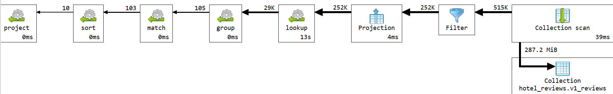
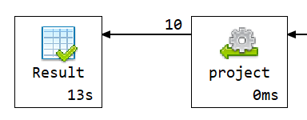

# Q2 - Hoteli po tipu gostiju

## Sta upit radi

Upit pronalazi hotele u Amsterdamu koji su najbolje ocenjeni od strane gostiju koji putuju kao parovi. U obzir ulaze samo hoteli koji imaju barem 20 recenzija sa tagom `Couple`.

## Kod upita

```js

db.v1_reviews.aggregate(
[
  {
    $lookup: {
      from: "v1_hotels",
      localField: "hotel_id",
      foreignField: "_id",
      as: "hotel"
    }
  },
  {
    $unwind: "$hotel"
  },
  {
    $match: {
      "hotel.city": "Amsterdam",
      tags: "Couple"
    }
  },
  {
    $group: {
      _id: "$hotel._id",
      hotel_name: { $first: "$hotel.name" },
      address: { $first: "$hotel.address" },
      city: { $first: "$hotel.city" },
      country: { $first: "$hotel.country" },
      average_reviewer_score: { $avg: "$reviewer_score" },
      review_count: { $sum: 1 }
    }
  },
  {
    $match: {
      review_count: { $gte: 20 }
    }
  },
  {
    $sort: {
      average_reviewer_score: -1,
      review_count: -1
    }
  },
  {
    $limit: 10
  },
  {
    $project: {
      _id: 0,
      hotel_id: "$_id",
      hotel_name: 1,
      address: 1,
      city: 1,
      country: 1,
      guest_type: "Couple",
      average_reviewer_score: {
        $round: ["$average_reviewer_score", 2]
      },
      review_count: 1
    }
  }
]);
```

## Sta usporava upit

- `$lookup` ka `v1_hotels`
- Grupisanje po hotelu da bi se izracunali prosecna ocena i broj recenzija parova

U v2 semi se koristi `v2_reviews_guest`, gde su osnovna polja hotela sacuvana u recenziji, a tip gosta je unapred izveden u `guest_types`

## Explain plan i vreme izvrsavanja

Vreme izvrsavanja: **13183 ms**.





## Primer izlaznog dokumenta

```json
{
  "hotel_name": "The Toren",
  "address": "Keizersgracht 164 Amsterdam City Center 1015 CZ Amsterdam Netherlands",
  "city": "Amsterdam",
  "country": "Netherlands",
  "review_count": 254.0,
  "hotel_id": "6a1ffc17ff73684035c731fb",
  "guest_type": "Couple",
  "average_reviewer_score": 9.53
}
```
