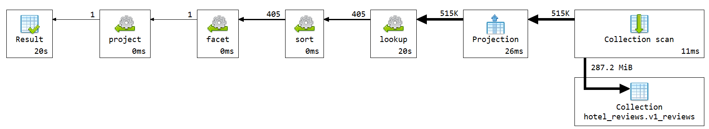

# Q3 - Recent reviews

## Sta upit radi

Upit pronalazi poslednjih 10 recenzija za konkretan hotel, u ovom primeru `Hotel Arena` u Amsterdamu. Pored recenzija, vraca osnovne podatke o hotelu i prosecnu ocenu u tom periodu.

## Kod upita

```js

db.v1_reviews.aggregate([
  {
    $lookup: {
      from: "v1_hotels",
      localField: "hotel_id",
      foreignField: "_id",
      as: "hotel"
    }
  },
  {
    $unwind: "$hotel"
  },
  {
    $match: {
      "hotel.name": "Hotel Arena",
      "hotel.city": "Amsterdam"
    }
  },
  {
    $sort: {
      review_date: -1
    }
  },
  {
    $facet: {
      latest_reviews: [
        {
          $limit: 10
        },
        {
          $project: {
            _id: 0,
            review_date: 1,
            reviewer_nationality: 1,
            reviewer_score: 1,
            positive_review: 1,
            negative_review: 1,
            positive_word_count: 1,
            negative_word_count: 1,
            tags: 1
          }
        }
      ],
      recent_score_summary: [
        {
          $limit: 10
        },
        {
          $group: {
            _id: null,
            recent_review_count: {
              $sum: 1
            },
            recent_average_score: {
              $avg: "$reviewer_score"
            }
          }
        }
      ],
      hotel_info: [
        {
          $limit: 1
        },
        {
          $project: {
            _id: 0,
            hotel_id: "$hotel._id",
            hotel_name: "$hotel.name",
            address: "$hotel.address",
            city: "$hotel.city",
            country: "$hotel.country",
            total_average_score: "$hotel.average_score",
            total_number_of_reviews: "$hotel.total_number_of_reviews"
          }
        }
      ]
    }
  },
  {
    $project: {
      hotel: {
        $arrayElemAt: [
          "$hotel_info",
          0
        ]
      },
      recent_review_count: {
        $arrayElemAt: [
          "$recent_score_summary.recent_review_count",
          0
        ]
      },
      recent_average_score: {
        $round: [
          {
            $arrayElemAt: [
              "$recent_score_summary.recent_average_score",
              0
            ]
          },
          2
        ]
      },
      latest_reviews: 1
    }
  }
]);
```

## Sta usporava upit

- `$lookup` ka `v1_hotels`
- `$match` po poljima iz spojene kolekcije, tek nakon lookup-a
- `$facet`, jer se posebno formiraju lista poslednjih recenzija, summary i hotel info.

U v2 semi je ovo optimizovano preko sablona podskupa: poslednjih 10 recenzija je ugnjezdeno u dokument hotela kao `recent_reviews`.

## Explain plan i vreme izvrsavanja

Vreme izvrsavanja iz: **19701 ms**.



## Primer izlaznog dokumenta

```json
{
  "latest_reviews": [
    {
      "review_date": "2017-08-03T00:00:00.000+0000",
      "reviewer_nationality": "Russia",
      "negative_review": "I am so angry that i made this post available via all possible sites...",
      "positive_review": "Only the park outside of the hotel was beautiful",
      "negative_word_count": 397,
      "positive_word_count": 11,
      "reviewer_score": 2.9,
      "tags": [
        "Leisure trip",
        "Couple",
        "Duplex Double Room",
        "Stayed 6 nights"
      ]
    }
  ],
  "hotel": {
    "hotel_id": "6a1ffc17ff73684035c72dee",
    "hotel_name": "Hotel Arena",
    "address": " s Gravesandestraat 55 Oost 1092 AA Amsterdam Netherlands",
    "city": "Amsterdam",
    "country": "Netherlands",
    "total_average_score": 7.7,
    "total_number_of_reviews": 1403
  },
  "recent_review_count": 10.0,
  "recent_average_score": 6.89
}
```
