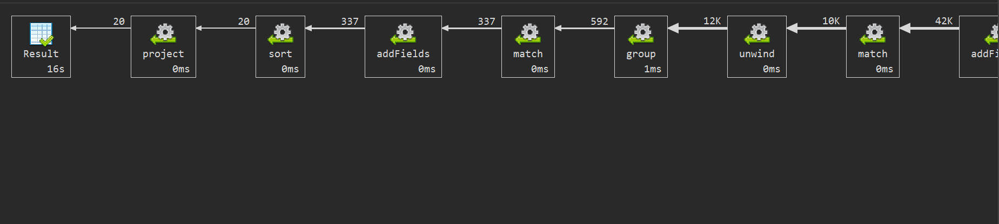
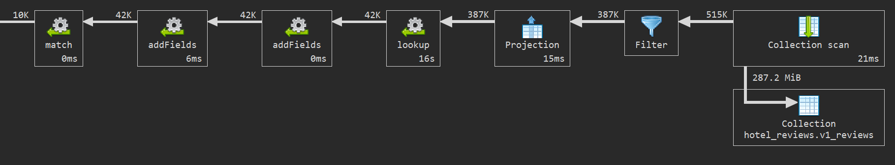

# Q4 - Cesti problemi u hotelima

## Sta upit radi

Upit pronalazi najcesce probleme koji se pominju u negativnim recenzijama hotela u Amsterdamu. Problemi se prepoznaju preko kljucnih reci i svrstavaju u kategorije kao sto su `noise`, `small_room`, `cleanliness`, `bed`, `air_conditioning` i `wifi`.


## Kod upita

```js

db.v1_reviews.aggregate(
  [
    {
      $lookup: {
        from: "v1_hotels",
        localField: "hotel_id",
        foreignField: "_id",
        as: "hotel"
      }
    },
    {
      $unwind: "$hotel"
    },
    {
      $match: {
        "hotel.city": "Amsterdam",
        negative_review: {
          $ne: "No Negative"
        }
      }
    },
    {
      $addFields: {
        negative_review_lower: {
          $toLower: "$negative_review"
        }
      }
    },
    {
      $addFields: {
        problem_types: {
          $setUnion: [
            {
              $cond: [
                {
                  $regexMatch: {
                    input: "$negative_review_lower",
                    regex: "noise|noisy|loud|soundproof"
                  }
                },
                ["noise"],
                []
              ]
            },
            {
              $cond: [
                {
                  $regexMatch: {
                    input: "$negative_review_lower",
                    regex: "small room|tiny room|room was small|rooms are small"
                  }
                },
                ["small_room"],
                []
              ]
            },
            {
              $cond: [
                {
                  $regexMatch: {
                    input: "$negative_review_lower",
                    regex: "dirty|cleanliness|unclean|not clean|dust|smell"
                  }
                },
                ["cleanliness"],
                []
              ]
            },
            {
              $cond: [
                {
                  $regexMatch: {
                    input: "$negative_review_lower",
                    regex: "bed|mattress|pillow"
                  }
                },
                ["bed"],
                []
              ]
            },
            {
              $cond: [
                {
                  $regexMatch: {
                    input: "$negative_review_lower",
                    regex: "air conditioning|aircondition|air con|a/c| ac |heating|climate"
                  }
                },
                ["air_conditioning"],
                []
              ]
            },
            {
              $cond: [
                {
                  $regexMatch: {
                    input: "$negative_review_lower",
                    regex: "wifi|wi fi|wi-fi|internet"
                  }
                },
                ["wifi"],
                []
              ]
            }
          ]
        }
      }
    },
    {
      $match: {
        $expr: {
          $gt: [
            {
              $size: "$problem_types"
            },
            0
          ]
        }
      }
    },
    {
      $unwind: "$problem_types"
    },
    {
      $group: {
        _id: {
          hotel_id: "$hotel._id",
          problem_type: "$problem_types"
        },
        hotel_name: { $first: "$hotel.name"},
        address: { $first: "$hotel.address"},
        city: { $first: "$hotel.city"},
        country: { $first: "$hotel.country"},
        total_hotel_reviews: { $first: "$hotel.total_number_of_reviews"},
        problem_review_count: { $sum: 1},
        average_problem_reviewer_score: { $avg: "$reviewer_score"}
      }
    },
    {
      $addFields: {
        problem_review_percentage: {
          $multiply: [
            {
              $divide: [
                "$problem_review_count",
                "$total_hotel_reviews"
              ]
            },
            100
          ]
        }
      }
    },
    {
      $match: {
        problem_review_count: {
          $gte: 10
        }
      }
    },
    {
      $sort: {
        problem_review_percentage: -1,
        problem_review_count: -1,
        average_problem_reviewer_score: 1
      }
    },
    {
      $limit: 20
    },
    {
      $project: {
        _id: 0,
        hotel_id: "$_id.hotel_id",
        hotel_name: 1,
        address: 1,
        city: 1,
        country: 1,
        problem_type: "$_id.problem_type",
        total_hotel_reviews: 1,
        problem_review_count: 1,
        problem_review_percentage: {
          $round: [
            "$problem_review_percentage",
            2
          ]
        },
        average_problem_reviewer_score: {
          $round: [
            "$average_problem_reviewer_score",
            2
          ]
        }
      }
    }
  ],
  {
    allowDiskUse: true
  }
);
```

## Sta usporava upit

- `$lookup` ka `v1_hotels`
- Pretvaranje svake negativne recenzije u mala slova
- `$regexMatch` provere
- `$setUnion`, `$unwind` i `$group` za svaki hotel + problem

U v2 semi su ovi rezultati unapred izracunati u `problem_stats`, pa se u upitu upitu ne radi regex

## Explain plan i vreme izvrsavanja

Vreme izvrsavanja iz: **24546 ms**.





## Primer izlaznog dokumenta

Rezultat je kombinacija hotel + tip problema, sa brojem recenzija, procentom negativnih recenzija i prosecnom ocenom tih recenzija.

```json
{
  "hotel_name": "Albus Hotel Amsterdam City Centre",
  "address": "Vijzelstraat 49 Amsterdam City Center 1017 HE Amsterdam Netherlands",
  "city": "Amsterdam",
  "country": "Netherlands",
  "total_hotel_reviews": 564,
  "problem_review_count": 37.0,
  "hotel_id": "6a1ffc17ff73684035c733a3",
  "problem_type": "noise",
  "problem_review_percentage": 6.56,
  "average_problem_reviewer_score": 7.41
}
```
