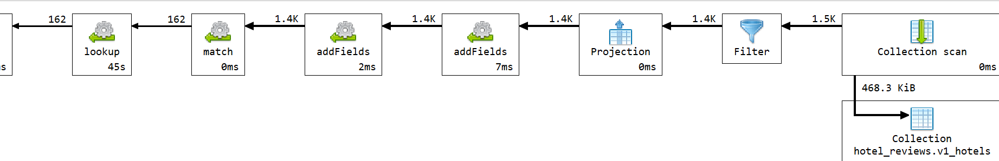
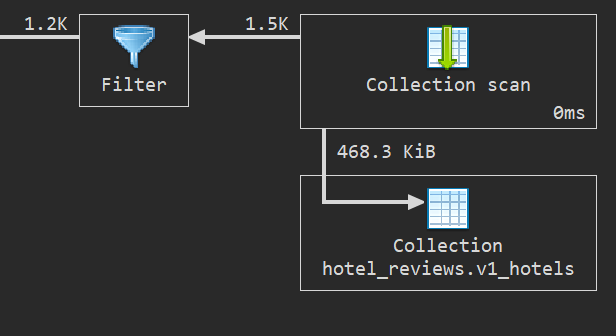

# Q5 - Hoteli u mojoj blizini

## Sta upit radi

Upit pronalazi top 10 hotela koji se nalaze u krugu od 100 kilometara od zadate lokacije korisnika. U ovom primeru korisnikova lokacija je `[9.1900, 45.4642]`, odnosno Milano. Hotel mora da ima bar 100 recenzija i prosecnu ocenu gostiju vecu ili jednaku `8.0`.

Udaljenost se racuna Haversine formulom.

Formula:
```text
distance = R * 2 * asin(sqrt(sin2(deltaLat / 2)+cos(lat1) * cos(lat2) * sin2(deltaLng / 2)))
lat 1, lng 1 - lokacija gosta
lat 2, lng 2 - lokacija hotela
deltaLat - razlika u latitude
deltaLng - razlika u longitude
```

## Kod upita

```js


db.v1_hotels.aggregate([
  {
    $match: {
      location: { $ne: null },
      "location.coordinates.0": { $ne: null },
      "location.coordinates.1": { $ne: null },
      total_number_of_reviews: { $gte: 100 }
    }
  },
  {
    $addFields: {
      user_longitude: 9.1900,
      user_latitude: 45.4642,
      hotel_longitude: { $arrayElemAt: ["$location.coordinates", 0] },
      hotel_latitude: { $arrayElemAt: ["$location.coordinates", 1] }
    }
  },
  {
    $addFields: {
      distance_km: {
        $let: {
          vars: {
            earth_radius_km: 6371,
            lat1_rad: {
              $degreesToRadians: "$user_latitude"
            },
            lat2_rad: {
              $degreesToRadians: "$hotel_latitude"
            },
            delta_lat_rad: {
              $degreesToRadians: {
                $subtract: [
                  "$hotel_latitude",
                  "$user_latitude"
                ]
              }
            },
            delta_lng_rad: {
              $degreesToRadians: {
                $subtract: [
                  "$hotel_longitude",
                  "$user_longitude"
                ]
              }
            }
          },
          in: {
            $multiply: [
              "$$earth_radius_km",
              2,
              {
                $asin: {
                  $sqrt: {
                    $add: [
                      {
                        $pow: [
                          {
                            $sin: {
                              $divide: [
                                "$$delta_lat_rad",
                                2
                              ]
                            }
                          },
                          2
                        ]
                      },
                      {
                        $multiply: [
                          {
                            $cos: "$$lat1_rad"
                          },
                          {
                            $cos: "$$lat2_rad"
                          },
                          {
                            $pow: [
                              {
                                $sin: {
                                  $divide: [
                                    "$$delta_lng_rad",
                                    2
                                  ]
                                }
                              },
                              2
                            ]
                          }
                        ]
                      }
                    ]
                  }
                }
              }
            ]
          }
        }
      }
    }
  },
  {
    $match: {
      distance_km: { $lte: 100 }
    }
  },
  {
    $lookup: {
      from: "v1_reviews",
      localField: "_id",
      foreignField: "hotel_id",
      as: "reviews"
    }
  },
  {
    $addFields: {
      average_reviewer_score: { $avg: "$reviews.reviewer_score" }
    }
  },
  {
    $match: {
      average_reviewer_score: { $gte: 8.0 }
    }
  },
  {
    $sort: {
      distance_km: 1,
      average_reviewer_score: -1,
      total_number_of_reviews: -1
    }
  },
  {
    $limit: 10
  },
  {
    $project: {
      _id: 0,
      hotel_id: "$_id",
      hotel_name: "$name",
      address: 1,
      city: 1,
      country: 1,
      average_reviewer_score: { $round: ["$average_reviewer_score", 2] },
      total_number_of_reviews: 1,
      distance_km: {
        $round: [
          "$distance_km",
          2
        ]
      },
      location: 1
    }
  }
]);
```

## Sta usporava upit

- Racunanje Haversine uradljenosti od svakog hotela
- `$lookup` ka recenzijama kako bi se izracunao prosek

U v2 semi se koristi `location: "2dsphere"` indeks i `$geoNear`, a `average_reviewer_score` je unapred sacuvan u hotel dokumentu

## Explain plan i vreme izvrsavanja

Vreme izvrsavanja iz : **44538 ms**.





## Primer izlaznog dokumenta

```json
{
  "address": "Via Silvio Pellico 2 Milan City Center 20121 Milan Italy",
  "city": "Milan",
  "country": "Italy",
  "total_number_of_reviews": 336,
  "location": {
    "type": "Point",
    "coordinates": [
      9.1893265,
      45.4648822
    ]
  },
  "hotel_id": "6a1ffc17ff73684035c7337f",
  "hotel_name": "TownHouse Duomo",
  "average_reviewer_score": 8.44,
  "distance_km": 0.09
}
```
