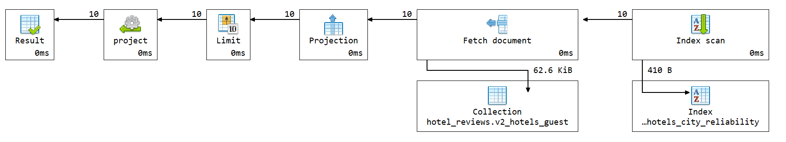

# Q1 - Pouzdani hoteli

## Sta ubrzava upit

Upit je ubrzan promenom seme iz `v1` u `v2_hotels_guest`. U `v1` su se prosecna ocena hotela, broj recenzija, prosek grada i `reliability_score`, a u novoj semi su ta polja unapred izracunata i sacuvana u dokumentu hotela:

```js
average_reviewer_score
review_count
city_average_score
reliability_score
```

Koristi se indeks:

```js
idx_hotels_city_reliability
```

## Kod upita

```js

db.v2_hotels_guest.aggregate([
  {
    $match: {
      city: "Amsterdam",
      review_count: { $gte: 100 }
    }
  },
  {
    $sort: {
      reliability_score: -1,
      average_reviewer_score: -1,
      review_count: -1
    }
  },
  {
    $limit: 10
  },
  {
    $project: {
      _id: 0,
      hotel_id: "$_id",
      name: 1,
      address: 1,
      city: 1,
      country: 1,
      average_reviewer_score: 1,
      review_count: 1,
      city_average_score: 1,
      reliability_score: 1
    }
  }
])
```

## Vreme izvrsavanja

Vreme izvrsavanja: **0 ms**.

Explain plan pokazuje koriscenje indeksa `idx_hotels_city_reliability`.

## Explain plan


