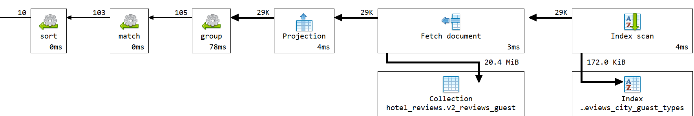
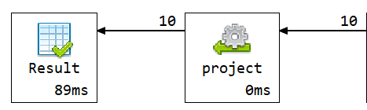

# Q2 - Hoteli po tipu gostiju

## Sta ubrzava upit

U `v2` recenzija sadrzi prosirenu referencu na hotel:

```js
hotel: {
  name,
  address,
  city,
  country
}
```

Pored toga, tip gosta je unapred izveden iz `tags` i sacuvan u polju:

```js
guest_types
```

Zbog toga upit moze direktno da filtrira po `hotel.city` i `guest_types`, bez lookup-a i bez parsiranja tagova u toku izvrsavanja.

Koristi se multikey compound indeks:

```js
idx_reviews_city_guest_types
```

## Kod upita

```js

db.v2_reviews_guest.aggregate([
  {
    $match: {
      "hotel.city": "Amsterdam",
      guest_types: "couple"
    }
  },
  {
    $group: {
      _id: "$hotel_id",
      name: { $first: "$hotel.name" },
      address: { $first: "$hotel.address" },
      city: { $first: "$hotel.city" },
      country: { $first: "$hotel.country" },
      average_reviewer_score: { $avg: "$reviewer_score" },
      review_count: { $sum: 1 }
    }
  },
  {
    $match: {
      review_count: { $gte: 20 }
    }
  },
  {
    $sort: {
      average_reviewer_score: -1,
      review_count: -1
    }
  },
  {
    $limit: 10
  },
  {
    $project: {
      _id: 0,
      hotel_id: "$_id",
      name: 1,
      address: 1,
      city: 1,
      country: 1,
      guest_type: "couple",
      average_reviewer_score: { $round: ["$average_reviewer_score", 2] },
      review_count: 1
    }
  }
])
```

## Vreme izvrsavanja

Vreme izvrsavanja: **97 ms**.

Explain plan pokazuje koriscenje `idx_reviews_city_guest_types`.

## Explain plan


