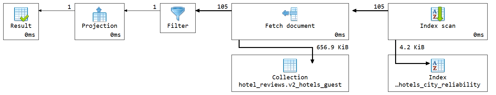

# Q3 - Recent reviews

## Sta ubrzava upit

U `v2` su poslednje recenzije vec ugnjezdene u dokument hotela:

```js
recent_reviews
recent_average_score
```

To je sablon podskupa: ne cuvaju se sve recenzije u hotel dokumentu, nego samo poslednjih 10 recenzija.

Za brzo pronalazenje hotela koristi se zajednicki indeks nad `v2_hotels_guest` koji pocinje sa `city`. U  explain planu koriscen je:

```js
idx_hotels_city_reliability
```

## Kod upita

```js

db.v2_hotels_guest.aggregate([
  {
    $match: {
      name: "Hotel Arena",
      city: "Amsterdam"
    }
  },
  {
    $project: {
      _id: 0,
      hotel: {
        hotel_id: "$_id",
        hotel_name: "$name",
        address: "$address",
        city: "$city",
        country: "$country",
        total_average_score: "$average_score",
        total_number_of_reviews: "$total_number_of_reviews"
      },
      recent_review_count: { $size: "$recent_reviews" },
      recent_average_score: 1,
      latest_reviews: "$recent_reviews"
    }
  }
])
```

## Vreme izvrsavanja

Vreme izvrsavanja iz: **0 ms**.

Explain plan pokazuje`totalKeysExamined: 105`, `totalDocsExamined: 105`.

## Explain plan


