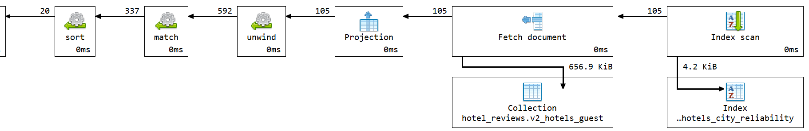
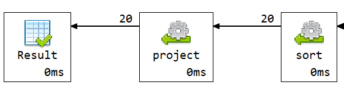

# Q4 - Common problems

## Sta ubrzava upit

Upit je ubrzan time sto se problemi iz negativnih recenzija vise ne detektuju u toku izvrsavanja upita. U `v2_hotels_guest` su problem statistike unapred izracunate i sacuvane u hotel dokumentu:

```js
problem_stats: [
  {
    problem_type,
    count,
    percentage,
    avg_score
  }
]
```

To kombinuje sablon proracunavanja i sablon atributa.

Koriscen je indeks:

```js
idx_hotels_city_reliability
```

## Kod upita

```js

db.v2_hotels_guest.aggregate([
  {
    $match: {
      city: "Amsterdam"
    }
  },
  {
    $unwind: "$problem_stats"
  },
  {
    $match: {
      "problem_stats.count": { $gte: 10 }
    }
  },
  {
    $sort: {
      "problem_stats.percentage": -1,
      "problem_stats.count": -1,
      "problem_stats.avg_score": 1
    }
  },
  {
    $limit: 20
  },
  {
    $project: {
      _id: 0,
      hotel_id: "$_id",
      name: 1,
      address: 1,
      city: 1,
      country: 1,
      review_count: 1,
      problem_type: "$problem_stats.problem_type",
      problem_review_count: "$problem_stats.count",
      problem_review_percentage: "$problem_stats.percentage",
      average_problem_reviewer_score: "$problem_stats.avg_score"
    }
  }
])
```

## Vreme izvrsavanja

Vreme izvrsavanja: **2 ms**.

Explain plan pokazuje `totalKeysExamined: 105` i `totalDocsExamined: 105`.

## Explain plan



