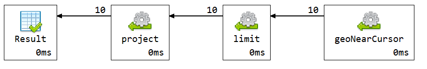

# Q5 - Hoteli u mojoj blizini

## Sta ubrzava upit

Upit je ubrzan geospatial indeksom. 
U `v2_hotels_guest` je `average_reviewer_score` vec sacuvan u dokumentu hotela, pa nema potrebe za lookup-om ka recenzijama.

Koristi se `2dsphere` indeks:

```js
idx_hotels_location_2dsphere
```

## Kod upita

```js

db.v2_hotels_guest.aggregate([
  {
    $geoNear: {
      near: {
        type: "Point",
        coordinates: [9.1900, 45.4642]
      },
      distanceField: "distance_m",
      maxDistance: 100000,
      query: {
        total_number_of_reviews: { $gte: 100 },
        average_reviewer_score: { $gte: 8.0 }
      },
      spherical: true
    }
  },
  {
    $limit: 10
  },
  {
    $project: {
      _id: 0,
      hotel_id: "$_id",
      name: 1,
      address: 1,
      city: 1,
      country: 1,
      average_reviewer_score: 1,
      total_number_of_reviews: 1,
      distance_km: { $round: [{ $divide: ["$distance_m", 1000] }, 2] },
      location: 1
    }
  }
])
```

## Vreme izvrsavanja

Vreme izvrsavanja: **4 ms**.

Explain plan pokazuje koriscenje indeksa `idx_hotels_location_2dsphere`.

## Explain plan


